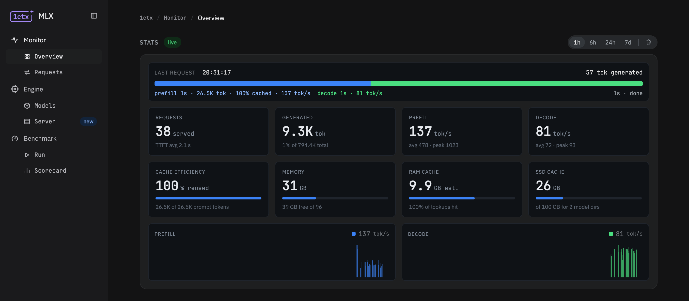

<p align="center">
  <a href="docs/screens/monitor.png">
    
  </a>
</p>

# 1ctx-mlx-engine

[](https://github.com/stefanprodan/1ctx-mlx-engine/actions/workflows/test.yml)

1ctx-mlx-engine installs, runs and watches an MLX inference engine
([mlx-serve](https://github.com/ddalcu/mlx-serve)) on an Apple Silicon Mac:
one page for the engine's install and configuration, the request in
flight, the throughput, the caches and the memory, with a week of history
behind them. A single binary, no dependencies.

## Features

**Monitor**

- Live throughput, time to first token and cache efficiency, with charts
  across 1h, 6h, 24h and 7d.
- The memory split: inference engine footprint, weights, the RAM prefix cache
  and the SSD tier against their budgets.
- The request in flight as a live bar: prefill, cached, decode.
- A models table to load, unload, set default and favorite; restart the
  engine and clear its SSD cache.
- A runtime panel: engine pid, RSS, CPU and GPU next to the host's chip,
  memory and disk.

**Requests**

- The last 50 requests with tokens, cached share, rates, time to first
  token and duration.

**Engine**

- Install, upgrade, roll back and configure mlx-serve as a LaunchAgent.

**Benchmark**

- Replay a scripted agent session against a model from empty caches:
  prefill, decode, cache hit rate and peak memory, run against run.
- A scorecard of the models, ranked by their newest run at a preset.

## Install

On macOS 26 or later, on Apple Silicon:

```sh
curl -fsSL https://raw.githubusercontent.com/stefanprodan/1ctx-mlx-engine/main/scripts/install.sh | bash
```

The script downloads the latest release, verifies its checksum, puts the
binary in `~/.1ctx-mlx-engine/bin` and starts it as a LaunchAgent, then
prints the URL of the page. Running it again is the upgrade. It never
uses `sudo` and touches no shell file. Models are downloaded to `~/models`
unless `--model-dir` says otherwise.

Arguments go to `service install`, and `VERSION` picks a release:

```sh
curl -fsSL https://raw.githubusercontent.com/stefanprodan/1ctx-mlx-engine/main/scripts/install.sh | bash -s -- --listen 0.0.0.0:11235
curl -fsSL https://raw.githubusercontent.com/stefanprodan/1ctx-mlx-engine/main/scripts/install.sh | VERSION=v0.2.0-rc.1 bash
```

Use the script, not a browser download: the binary is not notarized yet,
and macOS refuses an archive a browser has quarantined.

For the command on your `PATH`:
`ln -s ~/.1ctx-mlx-engine/bin/1ctx-mlx-engine /usr/local/bin/`.

To uninstall, run
`~/.1ctx-mlx-engine/bin/1ctx-mlx-engine service uninstall --purge`, then
remove `~/.1ctx-mlx-engine`. The models are not in it and stay.

## Docs

- [Monitor and Requests](docs/monitor.md)
- [Engine](docs/engine.md)
- [Benchmark](docs/benchmark.md)
- [API](docs/api.md)
- [Development](docs/development.md)

## License

Apache-2.0
